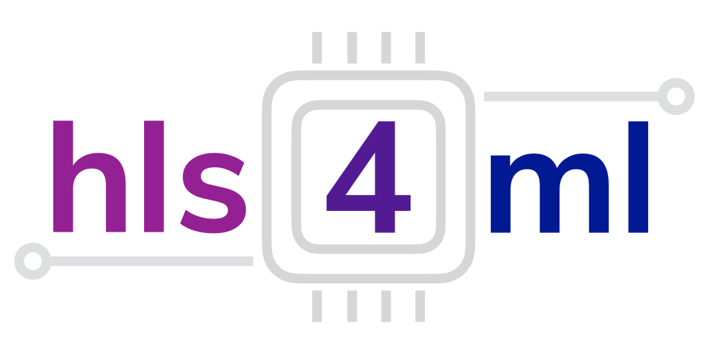

# Neural Network implementaiton in FPGA using HLS
Regarding the project, you can choose one of the two ways of 
implementing a neural network: 
 
1) You build the entire network in VHDL. In this case you have to make 
the function of the single node and then you have to instantiate every 
node of the network and route the signals that connect each node. 
 
2) You follow the programming flow of [HLS4ML](https://fastmachinelearning.org/hls4ml/#:~:text=hls4ml%20is%20a%20Python%20package,configured%20for%20your%20use%2Dcase!). In this case you start 
from the network description in python (the same description that you 
used for the training) and following the HLS4ML flow you fist obtain the 
HLS description and then using Vivado HLS you get an IP ready to be 
instantiated in a VHDL file. 
 
In the first case, you have to write yourself much more code in VHDL. In 
the second instead, you have to use a tool (HLS4ML). 
You can check the [tutorial](https://github.com/fastmachinelearning/hls4ml-tutorial) that there is online and understand if it is 
feasible or maybe it is better to tackle the first option.


## Hardware Requirements
- Arty A7-100T Artix-7 FPGA Development Board - PN: XC7A100TCSG324-1
- A host computer running Windows or GNU/Linux
- A USB-A to USB-Micro cable - to load the bitstream

## Software Requirements
- Vivado® Design Suite 2020.1, download from [here](https://www.xilinx.com/support/download)
- The Python environment used for the tutorials is specified in the environment.yml file. It can be setup like:
```
conda env create -f environment.yml
conda activate neural-network-fpga
```

### Flow of Project


### HLS-High Level Synthesis

- What is it ?
High-level synthesis (HLS), sometimes referred to as C synthesis, electronic system-level (ESL) synthesis, algorithmic synthesis, or behavioral synthesis, is an automated design process that takes an abstract behavioral specification of a digital system and finds a register-transfer level structure that realizes the given behavior.

- Why to use it ?
	- Productivity: Lower design complexity and faster simulation speed
	- Portability: Single source then multiple implementations
	- Quality: Quicker design space exploration then higher quality

C/C++ Constructs	RTL Components
----------------      ----------------
  Functions                Modules
  Arguments            Input/output ports
  Operators             Functional units
   Scalars             Wires or registers
   Arrays                  Memories
 Control flows          Control logics
#### General Workflow to use HLS

- Problem
- Define your inputs & output
        - They will translate as the parameters of your HLS top-level function
- Write up your code
- Test your C++ code
- Synthesis, i.e. convert to VHDL code
        - Optimise it to get the desired performance while staying in your HW limits
- Test synthesised design
- Export design, typically in Vivado IP (Intellectual Property) format
- Implement in Vivado on actual FPGA

#### hls4ml

[hls4ml](https://fastmachinelearning.org/hls4ml/#:~:text=hls4ml%20is%20a%20Python%20package,configured%20for%20your%20use%2Dcase!) is a Python package for machine learning inference in FPGAs. We create firmware implementations of machine learning algorithms using high level synthesis language (HLS). We translate traditional open-source machine learning package models into HLS that can be configured for your use-case!


#### ap_ctrl_chain
The following figure shows the behavior of the block-level handshake signals created by the ap_ctrl_chain control protocol for a sequential execution. In the following figure, the first transaction of the HLS design completes, and the second transaction starts immediately because ap_continue is High when ap_done is High. However, the design halts at the end of the second transaction until ap_continue is asserted High.
<div style="text-align:center">
  
</div>

### Neural Network

### UART Implementation

#### UART Transmitter


#### UART Receiver


### FIFO - First Input First Output
The acronym FIFO stands for First In First Out. FIFOs are used everywhere in FPGA and ASIC designs, they are one of the basic building blocks. And they are very handy! FIFOs can be used for any of these purposes:
- Crossing clock domains
- Buffering data before sending it off chip (e.g. to DRAM or SRAM)
- Buffering data for software to look at at some later time
- Storing data for later processing

A FIFO can be thought of a one-way tunnel that cars can drive through. At the end of the tunnel is a toll with a gate. Once the gate opens, the car can leave the tunnel. If that gate never opens and more cars keep entering the tunnel, eventually the tunnel will fill up with cars. This is called FIFO Overflow and in general it’s not a good thing. How deep the FIFO is can be thought of as the length of the tunnel. The deeper the FIFO, the more data can fit into it before it overflows. FIFOs also have a width, which represents the width of the data (in number of bits) that enters the FIFO. Below is an image of the basic interface of any FIFO. These signals will always be found when you look at any FIFO. Often there are more signals that add additional features, such as a count of the number of words in the FIFO. See the figure below:


## Some expected errors
if you have faced to a problem with jupyter notebook while creating the environment with hls4ml-tutorial, try the following command to have compatible version:
```
pip install --upgrade notebook==6.4.12
```

## Refrences
[What is a FIFO in an FPGA](https://nandland.com/lesson-8-what-is-a-fifo/What%20is%20a%20FIFO%20in%20an%20FPGA)

[Block Level Control Protocols](https://docs.xilinx.com/r/en-US/ug1399-vitis-hls/Block-Level-Control-Protocols) 
